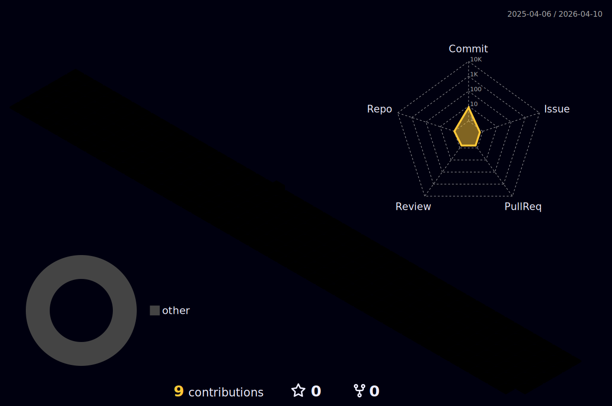

<h1 align="center">
  
</h1>

<p align="center">
  <a href="https://www.linkedin.com/in/guilherme-barasuol"></a>
  <a href="https://github.com/GuilhermeScherner"></a>
  
</p>

---

### About me

```python
class GuilhermeScherner:
    role      = "Backend Developer"
    location  = "Brazil 🇧🇷"
    languages = ["Python", "TypeScript", "C"]
    interests = ["AI / ML", "Trading Systems", "Microservices", "Web3"]

    currently_building = [
        "AI-powered trading platforms",
        "Restaurant management SaaS",
        "Agricultural e-commerce",
    ]
```

---

### Tech Stack

**Languages & Frameworks**


**Data & Messaging**


**Cloud & DevOps**


**AI & Web3**


---

### GitHub Stats

<p align="center">
  
  
</p>

<p align="center">
  
</p>

---

### 3D Contribution Graph

<p align="center">
  
</p>

---

### Contribution Snake

<picture>
  <source media="(prefers-color-scheme: dark)" srcset="https://raw.githubusercontent.com/GuilhermeScherner/GuilhermeScherner/output/github-snake-dark.svg" />
  <source media="(prefers-color-scheme: light)" srcset="https://raw.githubusercontent.com/GuilhermeScherner/GuilhermeScherner/output/github-snake.svg" />
  
</picture>

---

### Featured Projects

| Project | Stack | Description |
|---------|-------|-------------|
| [**bank-simulator**](https://github.com/GuilhermeScherner/bank-simulator) | Python, FastAPI, Kafka, Docker | Event-driven microservices banking system |
| [**pomar**](https://github.com/GuilhermeScherner/pomar) | Python, FastAPI, React, PostgreSQL | Full-stack application with Docker |
| [**game-2048-allegro**](https://github.com/GuilhermeScherner/game-2048-allegro) | C, Allegro | 2048 game built in C with Allegro graphics |
| [**proffy**](https://github.com/GuilhermeScherner/proffy) | TypeScript, React Native, Node.js | Cross-platform mobile education app |

---

<p align="center">
  
</p>
